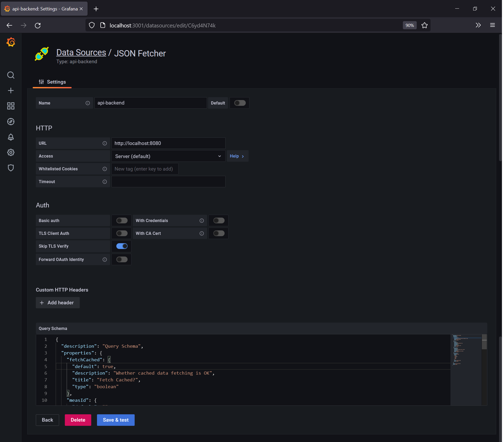
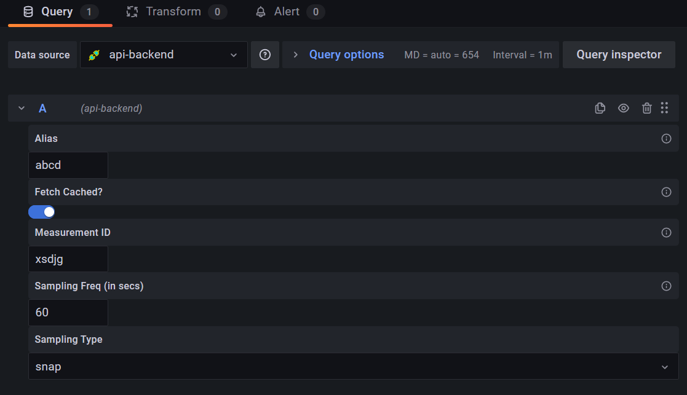
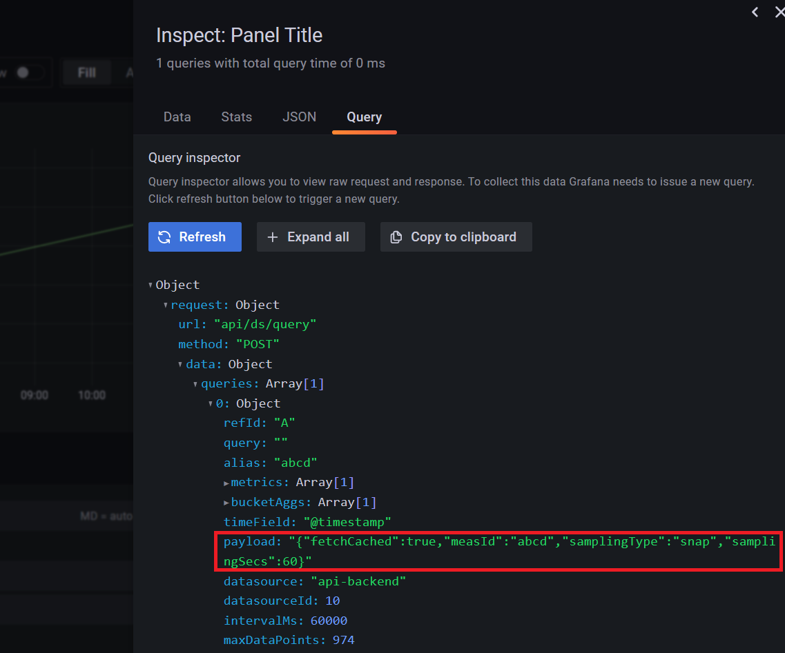
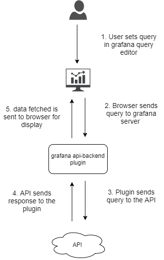

#  Grafana API Backend Datasource Plugin


* This is a Grafana Data Source Plugin for getting data from HTTP API
* User inputs in the query editor can be customized by setting JSON schema in the datasource configuration page
* Now end user can create queries in query editor without understanding JSON
* Alerts are also supported since it is a backend datasource plugin 

## Create JSON schema for query payload
* You can generate JSON schema from example query payload JSON [here](https://easy-json-schema.github.io/) 

## Example JSON schema
* Paste the following in the Query schema text box of the json-backend datasource settings screen
```json
{
	"description": "Query Schema",
	"properties": {
		"fetchCached": {
			"default": true,
			"description": "Whether cached data fetching is ok",
			"title": "Fetch Cached?",
			"type": "boolean"
		},
		"measId": {
			"default": "",
			"description": "Measurement ID",
			"maxLength": 20,
			"minLength": 15,
			"title": "Measurement ID",
			"type": "string"
		},
		"samplingSecs": {
			"default": 60,
			"description": "Sampling Freq. in secs",
			"multipleOf": 2,
			"title": "Sampling Freq (in secs)",
			"type": "integer"
		},
		"samplingType": {
			"default": "snap",
			"enum": [
				"snap",
				"average",
				"max",
				"min",
				"sum"
			],
			"title": "Sampling Type",
			"type": "string"
		}
	},
	"title": "Query Editor GUI",
	"type": "object"
}
```


* The grafana query editor for this datasource will look like the following



* It can be seen in the query inspector that the JSON payload is generated from user inputs and request is sent



## End points to be implemented by the API
* The plugin requires these endpoints to be implemented by the API server
* API server should listen for GET requests at `/` and return 200 OK status code as a health check endpoint implementation
* API server should listen for POST requests at `/` to respond to queries with data. The POST request body will contain the query information like series name, start and end timestamps, query payload etc. The response should have timestamps and values for a single series.
* A sample API request that will sent to API server by grafana can be like
```json
{
    "RefID": "A",
    "QueryType": "",
    "MaxDataPoints": 974,
    "Interval": 60000000000,
    "TimeRange": {
        "From": "2022-10-08T00:00:00+05:30",
        "To": "2022-10-08T14:44:09.586+05:30"
    },
    "JSON": {
        "refId": "A",
        "alias": "abcd",
        "payload": "{\"fetchCached\":true,\"measId\":\"abcd\",\"samplingType\":\"snap\",\"samplingSecs\":60}",
        "bucketAggs": [
            {
                "field": "@timestamp",
                "id": "2",
                "settings": {
                    "interval": "auto"
                },
                "type": "date_histogram"
            }
        ],
        "datasource": "api-backend",
        "datasourceId": 10,
        "intervalMs": 60000,
        "maxDataPoints": 974,
        "metrics": [
            {
                "id": "1",
                "type": "count"
            }
        ],
        "query": "",
        "timeField": "@timestamp"
    }
}
```
* A sample API response can be like 
```json
{
	"frames":[
		{
			"columns":[
				{"name": "@timestamp", "values": [1665216413748, 1665219977028], "labels": null},
				{"name": "abcd", "values": [5, 10], "labels": null}
			]
		}
	]
}
```

The times in response should be UNIX epoch timestamps in seconds 

## Data flow


# Plugin installation
* Make sure node, yarn, go, mage are installed 
* Clone this github repository
* Open a command line in the downloaded folder and run the following commands
```
yarn install
```
```
yarn build
```
```
mage -v build:windows
```
* Once all the commands are run successfully, a `dist` folder is created
* Copy the generated `dist` folder and paste it in a folder named `grafana-api-backend-datasource` inside the grafana plugins folder. For example, the folder can be `C:\Program Files\GrafanaLabs\grafana\data\plugins\grafana-api-backend-datasource\dist`
* Open grafana plugins section and select data source by the name `api-backend`

# Developer documentation
## Pre-requisites for plugin development

### For Back-end
* Install Go
* Install Mage
* Install Go extension in VS code (optional)

### For Front-end
* Install node
* Install yarn (```npm install --global yarn```)

## Setting up the development environment

### Frontend

1. Install dependencies with ```yarn install```

2. Build plugin in development mode or run in watch mode with ```yarn dev``` or ```yarn watch```

3. Build plugin in production mode with ```yarn build```

### Backend

1. Update [Grafana plugin SDK for Go](https://grafana.com/docs/grafana/latest/developers/plugins/backend/grafana-plugin-sdk-for-go/) dependency to the latest minor version:

   ```bash
   go get -u github.com/grafana/grafana-plugin-sdk-go
   go mod tidy
   ```

2. Build backend plugin binaries for Linux, Windows and Darwin with ```mage -v``` or ```mage -v build:windows``` for building only for windows

3. List all available Mage targets for additional commands using ```mage -l```

4. Test for backend datasource located at `plugin_test.go`. Test can be run easily in vs code with GO VS code extension installed

## References

- Documentation on [Backend plugins](https://grafana.com/docs/grafana/latest/developers/plugins/backend/)
- [Build a data source backend plugin tutorial](https://grafana.com/tutorials/build-a-data-source-backend-plugin)
- [Grafana documentation](https://grafana.com/docs/)
- [Grafana Tutorials](https://grafana.com/tutorials/) - Grafana Tutorials are step-by-step guides that help you make the most of Grafana
- [Grafana UI Library](https://developers.grafana.com/ui) - UI components to help you build interfaces using Grafana Design System
- [Grafana plugin SDK for Go](https://grafana.com/docs/grafana/latest/developers/plugins/backend/grafana-plugin-sdk-for-go/)
- [Docs on Grafana Dataframe datastructure](https://grafana.com/docs/grafana/latest/developers/plugins/data-frames/#the-data-frame)
